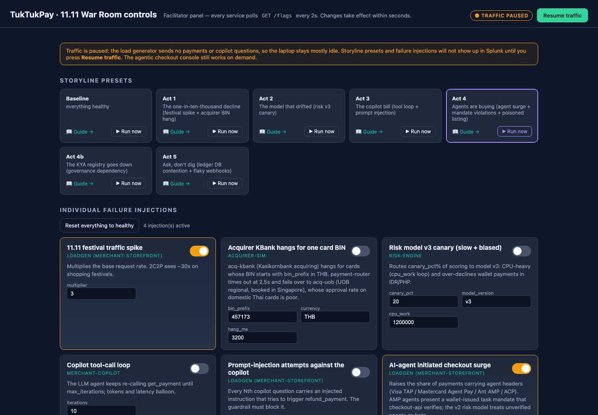
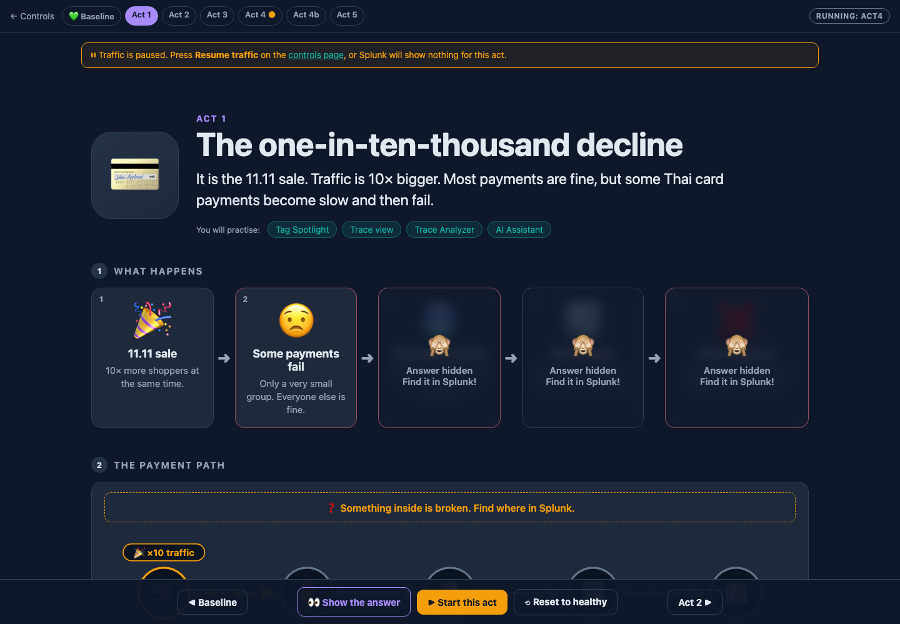
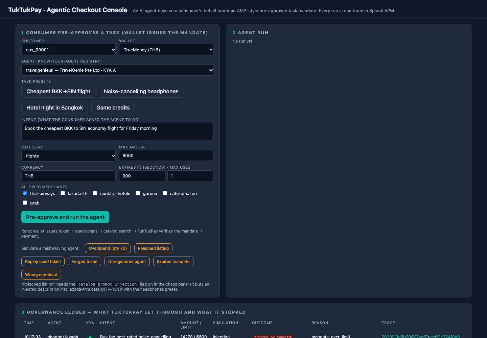
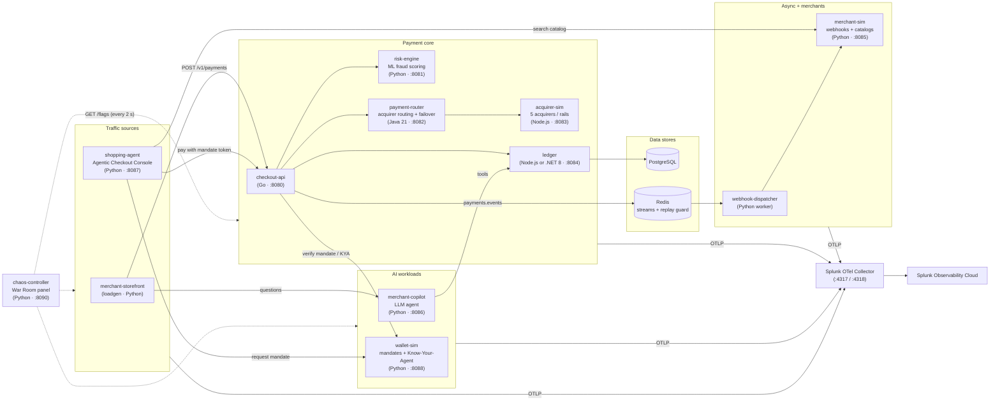
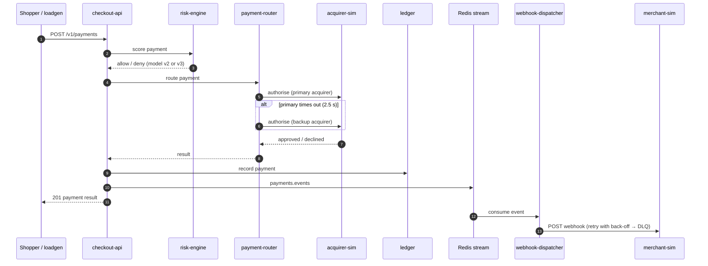

# TukTukPay

A fictional Bangkok-based **payment service provider (PSP)** built as a realistic, fully instrumented demo platform
for **OpenTelemetry** and **Splunk Observability Cloud**. Eleven polyglot microservices — Go, Java, Node.js, .NET and
Python — process card, wallet and QR payments across six Southeast Asian currencies, route them to five simulated
acquirers, and include two AI workloads: an LLM **merchant copilot** and **AI shopping agents** that pay on a
consumer's behalf under wallet-issued spending mandates.

A built-in **War Room control panel** injects realistic failures (festival traffic spikes, a hanging acquirer, a
drifting fraud model, an AI tool-call loop, prompt injection, database contention…) so you can practise finding
root cause with traces, metrics, profiling, **logs** and AI-assisted troubleshooting.

Every service writes structured, trace-correlated logs (`trace_id`, `span_id`, `service.name`, business fields such
as `payment.id`, `payment.acquirer`, `mandate.block_reason`), exported over OTLP and shipped by the collector to
**Splunk Cloud Platform** over HEC; **Log Observer Connect** links them into Observability Cloud so Related Content,
the AI Assistant and the AI Troubleshooting Agent can quote the line that explains each incident. See
[docs/logs-setup.md](docs/logs-setup.md), [docs/log-schema.md](docs/log-schema.md) and
[docs/ai-troubleshooting.md](docs/ai-troubleshooting.md).

The reference deployment is **Kubernetes** — a local [kind](https://kind.sigs.k8s.io/) cluster in one command, or any
cluster such as EKS — with the Splunk OpenTelemetry Collector Helm chart and the OpenTelemetry Operator injecting the
Java, Node.js and .NET agents. That is where the AI Troubleshooting Agent's **Remediation Plan** appears (it needs
Kubernetes alerts), so two acts exist only there: a memory leak that gets the ledger OOMKilled and a bad rollout that
crash-loops the wallet. Docker Compose remains as a lighter alternative for laptops without the Kubernetes acts.

> **Everything is simulated.** TukTukPay is fictional. Real bank, wallet and merchant names are used only to make the
> scenario recognisable; every latency, approval rate, decline and outage is generated by this code and says nothing
> about how those companies perform. No real money, no real card data, no real PII.

### Screenshots

**War Room control panel** — <http://localhost:8090>: storyline presets and individual failure injections.



**Act guide** — <http://localhost:8090/act/act1>: picture-first explainer for each storyline, with the answer hidden until you find it in Splunk.



**Agentic Checkout Console** — <http://localhost:8087>: an AI shopping agent pays under a wallet-issued mandate; attack buttons simulate a misbehaving agent.



---

## Contents

1. [Architecture](#architecture)
2. [Services](#services)
3. [How a payment flows](#how-a-payment-flows)
4. [Quick start (Kubernetes) — step by step](#quick-start-kubernetes--step-by-step)
5. [Running the War Room scenarios](#running-the-war-room-scenarios)
6. [Alternative: Docker Compose](#alternative-docker-compose)
7. [Optional: real LLMs, .NET ledger, dual-shipping](#optional-real-llms-net-ledger-dual-shipping)
8. [Useful commands](#useful-commands)
9. [Logs and AI troubleshooting](#logs-and-ai-troubleshooting)
10. [Troubleshooting](#troubleshooting)
11. [Repository layout](#repository-layout)

---

## Architecture



**Key design choices**

* **100 % OpenTelemetry.** No vendor SDK in any application. Where the telemetry goes is decided only by the collector
  config in [`otel/`](otel/) — swap or add an exporter without touching application code.
* **A mix of instrumentation styles**, on purpose: manual SDK spans in Go, zero-code agents for Java / Node.js / .NET /
  Python, and GenAI semantic conventions (`gen_ai.*`) for the AI services.
* **Business context on every span.** `merchant.id`, `payment.acquirer`, `payment.card.bin`, `payment.method`,
  `payment.currency`, `payment.initiator`, `risk.model_version`, `payment.decline_reason`, `agent.protocol`,
  `mandate.block_reason`… so you can slice errors and latency by business dimension.
* **One trace end to end** — including the async webhook delivery (trace context carried through Redis Streams) and
  the AI agent's LLM calls and tool calls.
* **Deterministic behaviour.** Approvals and declines are hashed from the payment id, so scenarios reproduce reliably.

---

## Services

| Service | Language | Instrumentation | Port | Role |
|---|---|---|---|---|
| [`checkout-api`](services/checkout-api/README.md) | Go 1.24 | OTel SDK, manual | 8080 | Public payments API; verifies agent mandates |
| `risk-engine` | Python / FastAPI | zero-code | 8081 | ML fraud scoring (model v2, canary v3) |
| `payment-router` | Java 21 | Splunk Java agent, zero-code | 8082 | Picks the acquirer, fails over on timeout |
| `acquirer-sim` | Node.js / Express | `@splunk/otel`, zero-code | 8083 | 5 simulated acquirers / wallet / QR rails |
| `ledger` | Node.js (or .NET 8) + PostgreSQL | zero-code | 8084 | System of record (SQL spans) |
| `webhook-dispatcher` | Python worker | zero-code + consumer span | — | Delivers payment webhooks with retries + dead-letter queue |
| `merchant-sim` | Python / FastAPI | zero-code | 8085 | Merchants' webhook endpoints and product catalogs |
| `merchant-copilot` | Python / FastAPI | GenAI semantic conventions | 8086 | LLM agent answering "why did payment X fail?"; guardrails |
| `shopping-agent` | Python / FastAPI + web UI | GenAI semantic conventions | 8087 | Agentic Checkout Console: an AI agent buys under a mandate; attack buttons |
| `wallet-sim` | Python / FastAPI | zero-code | 8088 | Issues scoped task mandates; Know-Your-Agent registry |
| `loadgen` (`merchant-storefront`) | Python | root spans | — | Realistic regional traffic mix, festival spikes, agent checkouts |
| `chaos-controller` | Python / FastAPI | none (tooling) | 8090 | War Room panel + picture guides; `GET /flags` polled by all services |
| `otel-collector` | Splunk Distribution of the OTel Collector | — | 4317 / 4318 | Receives OTLP, exports to Splunk Observability Cloud |
| `postgres`, `redis` | — | — | internal | Ledger database; event stream + mandate replay protection |

---

## How a payment flows



For an **AI agent payment**, the shopping agent first asks `wallet-sim` for a task mandate (which agent, max amount,
allowed merchants, expiry, single use), searches the merchant catalog, then pays with the mandate token.
`checkout-api` verifies the token, the limit, the merchant, expiry, replay and the agent's Know-Your-Agent rating
before the payment ever reaches risk scoring or an acquirer.

---

## Quick start (Kubernetes) — step by step

One script creates a local **kind** cluster, builds the images, installs the Splunk OpenTelemetry Collector Helm
chart with the OpenTelemetry Operator, and deploys the stack. For an existing cluster (EKS, GKE, AKS, …) see
[k8s/README.md](k8s/README.md).

### Prerequisites

| Need | Notes |
|---|---|
| Docker Desktop (or Docker Engine) | Allocate **4 CPUs and 8 GB RAM**; kind runs the cluster as a container (`brew install kind`) |
| `kind`, `kubectl`, `helm` | `brew install kind kubectl helm` on macOS; any recent versions |
| Git | to clone the repo |
| A Splunk Observability Cloud org | plus an **ingest** access token (Settings → Access Tokens) and your realm (e.g. `us1`, `eu0`, `au0`, `jp0`, `sg0`) |
| *(for logs)* a Splunk Cloud Platform stack | an index, a HEC token and the IP allow lists — [docs/logs-setup.md](docs/logs-setup.md); without it logs stay in `kubectl logs` |
| Internet access on first run | base images, packages, the Helm chart and the agent images (≈ 5–8 minutes) |

### Step 1 — Clone the repository

```bash
git clone https://github.com/khsydney/tuktukpay.git
cd tuktukpay
```

### Step 2 — Create your `.env`

```bash
cp .env.example .env
```

Open `.env` and set at least these three values (plus the HEC ones if you have a Splunk Cloud stack):

```dotenv
SPLUNK_REALM=us1                         # your realm
SPLUNK_ACCESS_TOKEN=<your ingest token>
DEPLOYMENT_ENVIRONMENT=tuktukpay-dev     # the APM environment name you will filter on (one per team)
SPLUNK_HEC_URL=https://http-inputs-<stack>.splunkcloud.com:443/services/collector   # optional: logs
SPLUNK_HEC_TOKEN=<HEC token>
SPLUNK_HEC_INDEX=tuktukpay
```

Everything else has working defaults (the AI services use an offline **mock** LLM, so no API key is needed).
`.env` is git-ignored — never commit it.

### Step 3 — Create the cluster and deploy

```bash
k8s/kind-up.sh                    # or: make k8s-up
```

What it does: creates the `tuktukpay` kind cluster, builds the images with Compose and loads them into the node,
installs the **Splunk OTel Collector chart** (collector agent, cluster receiver, OpenTelemetry Operator, Splunk Platform
log exporter when the HEC variables are set), applies [`k8s/tuktukpay.yaml`](k8s/tuktukpay.yaml) into namespace
`tuktukpay` with the application settings from `.env` (a ConfigMap + a Secret the pods read through `envFrom`), and
waits for the rollout. First run ≈ 5–8 minutes; re-running it is safe (it rebuilds changed images and upgrades the
release).

**Changed `.env`?** Run `k8s/kind-up.sh` (or `make k8s-up`) again: Splunk/HEC values go to the collector chart, the
application values to the ConfigMap/Secret, and the application pods are rolled when those changed. The same works
after a code change (the image is rebuilt and loaded; restart the deployment if its manifest did not change).

### Step 4 — Reach the UIs and check that everything is running

```bash
k8s/port-forward.sh               # or: make k8s-forward — tunnels :8090 :8087 :8080 :8086 :8088 :8085 to localhost
kubectl -n tuktukpay get pods     # every pod 1/1 Running
scripts/smoke-test.sh             # or: make smoke — sends payments + an agent payment + a copilot question
```

kind has no load balancer, so the UIs are reached through `kubectl port-forward` tunnels; the script keeps them
alive across the pod restarts the Kubernetes acts cause. A successful smoke test prints health checks, a payment
result with a `payment_id`, the ledger read-back and a copilot answer.

### Step 5 — Open the web UIs

| URL | What it is |
|---|---|
| http://localhost:8090 | **War Room controls** — scenario presets, picture guides, individual failure flags, pause/resume traffic |
| http://localhost:8087 | **Agentic Checkout Console** — run an AI agent purchase and try the attack buttons |
| http://localhost:8080/healthz | checkout-api health |

### Step 6 — See the data in Splunk Observability Cloud

1. Go to **APM** and select your `DEPLOYMENT_ENVIRONMENT`.
2. Within about a minute the **service map** shows
   `merchant-storefront → checkout-api → risk-engine / payment-router → acquirer-sim / ledger → …`.
3. Open any `POST /v1/payments` trace to follow one payment end to end; **Related Content** takes you to the pod in
   the Kubernetes navigator and, with Log Observer Connect, to the log lines of that trace.
4. **Infrastructure → Kubernetes**: cluster `kind-tuktukpay`, namespace `tuktukpay` — the pods, their restarts,
   CPU and memory against their limits.
5. *(Recommended)* Index the business tags as APM MetricSets (Settings → APM MetricSets) so you can break errors
   down by them in Tag Spotlight: `merchant.id`, `payment.acquirer`, `payment.card.bin`, `payment.method`,
   `payment.currency`, `payment.initiator`, `payment.decline_reason`, `risk.model_version`, `agent.protocol`,
   `mandate.block_reason`.
6. *(Recommended)* Create the dashboard and the detectors with Terraform — the APM and Kubernetes detectors are what
   the AI Troubleshooting Agent runs on:

   ```bash
   cd splunk/terraform
   export SFX_AUTH_TOKEN=<an API token>          # not the ingest token
   terraform init
   terraform apply -var realm=<realm> -var environment=<your DEPLOYMENT_ENVIRONMENT> -var k8s_namespace=tuktukpay
   ```

### Step 7 — Stop or reset

```bash
make pause                        # stop simulated traffic but keep everything running (saves laptop CPU)
make resume                       # start traffic again
make reset                        # every failure flag off
k8s/port-forward.sh stop          # close the tunnels
kind delete cluster --name tuktukpay    # or: make k8s-down — removes the whole cluster
```

---

## Running the War Room scenarios

Open **http://localhost:8090**. Each storyline card opens a **picture guide** (diagram, what happens, what to look
for, the answer hidden until you reveal it). Press **▶ Start this act** on the guide, or **▶ Run now** on the card.

| Preset | What breaks | What you practise |
|---|---|---|
| `baseline` | nothing — everything healthy | learn what normal looks like |
| `act1` — The one-in-ten-thousand decline | 10× festival spike + one acquirer hangs for one card BIN → slow failover to a backup acquirer that declines | Tag Spotlight on business tags, failover inside a trace |
| `act2` — The model that drifted | fraud model v3 canary (20 %): CPU-heavy and over-declines wallets in IDR / PHP | approval rate by model version, AlwaysOn Profiling, AI troubleshooting |
| `act3` — The copilot bill | LLM copilot stuck in a tool-call loop + prompt-injection refund attempts | GenAI traces, token and cost metrics, guardrail events |
| `act4` — Agents are buying | 25 % agent traffic, mandate violations, a poisoned product listing | agent segmentation, mandate verification, end-to-end agent trace |
| `act4b` — The agent list goes down | Know-Your-Agent registry returns 503 → every agent payment fails closed | dependency incidents in AI governance |
| `act5` — Ask, don't dig | ledger connection pool shrinks + one merchant's webhook turns flaky | Database Query Performance, async retries in the same trace, AI Assistant |
| `act6` — The leaky ledger *(Kubernetes)* | the ledger retains memory until its 384 MiB limit → **OOMKilled** → restart loop; writes fail while it is down | Kubernetes alert → AI Troubleshooting Agent → **Remediation Plan**; `memory.pressure` logs |
| `act7` — The bad rollout *(Kubernetes)* | wallet-sim exits seconds after start as if a migration failed → **CrashLoopBackOff** → every agent payment fails closed | restart alert, the service's last log line, rollback as the plan |

Two more Kubernetes incidents are scripts rather than flags, because they are rollouts: `k8s/acts/oversize-rollout.sh`
(a pod no node can fit → Pending) and `k8s/acts/bad-image.sh` (ImagePullBackOff); `k8s/acts/rollback.sh <deployment>`
undoes them. Expected answers, evidence lines and AI prompts for every act: [docs/ai-troubleshooting.md](docs/ai-troubleshooting.md).

From the command line (through the port-forward):

```bash
make act1                                   # or: curl -X POST localhost:8090/scenarios/act1  (… act7)
make reset                                  # everything healthy again
make flags                                  # show current failure flags
```

Every flag can also be toggled individually (with parameters) on the controls page:
`festival_spike`, `acquirer_kbank_timeout`, `router_failover_disabled`, `risk_model_drift`, `copilot_tool_loop`,
`copilot_prompt_injection`, `agent_traffic_surge`, `agent_mandate_violations`, `catalog_prompt_injection`,
`kya_registry_down`, `ledger_db_slow`, `webhook_merchant_flaky`, `ledger_memory_leak`, `wallet_crash_loop`.

---

## Alternative: Docker Compose

The same stack runs under Docker Compose for laptops that cannot host a cluster. Everything works except the
Kubernetes-only acts (`act6`, `act7`, the rollout scripts) and the Remediation Plan, because there are no
Kubernetes alerts.

```bash
cp .env.example .env && $EDITOR .env      # same variables as above
docker compose up -d --build              # or: make up — first build ≈ 5–8 min
docker compose ps && scripts/smoke-test.sh
make pause / make resume / make reset     # same controls, same UIs on the same ports (no port-forward needed)
docker compose down -v                    # stop and wipe the database (or: make down)
```

Do not run both at once on one machine: they share the host ports and the laptop's memory.

---

## Optional: real LLMs, .NET ledger, dual-shipping

**Real LLM providers** — `mock | openai | anthropic | bedrock`, configured in `.env` for both deployments:

```dotenv
COPILOT_PROVIDER=openai          # mock | openai | anthropic | bedrock
COPILOT_MODEL=gpt-4o-mini
OPENAI_API_KEY=...               # or ANTHROPIC_API_KEY / AWS credentials + AWS_REGION
AGENT_PROVIDER=mock              # same options for the shopping agent
```

Then `make k8s-up` (Kubernetes: the keys land in the `tuktukpay-secrets` Secret and the pods are rolled) or
`docker compose up -d merchant-copilot shopping-agent` (Compose).

**.NET ledger** instead of Node.js (same API, same traces): on Kubernetes swap the `ledger` Deployment's image and
annotation as described in [k8s/README.md](k8s/README.md#4-net-variant); on Compose `make dotnet`.

**Dual-ship** to a second backend during an evaluation (Compose; add `DD_API_KEY` to `.env`):

```bash
make dualship    # docker compose -f docker-compose.yml -f docker-compose.dualship.yml up -d otel-collector
```

---

## Useful commands

```bash
kubectl -n tuktukpay get pods                            # state, restarts (watch them climb in act6/act7)
kubectl -n tuktukpay logs deploy/checkout-api -f         # follow one service's JSON logs
kubectl -n tuktukpay logs deploy/ledger --previous       # the last lines of a container that was OOMKilled
kubectl -n tuktukpay get events --sort-by=.lastTimestamp # OOMKilled, BackOff, FailedScheduling …
k8s/kind-up.sh && kubectl -n tuktukpay rollout restart deployment/<service>   # redeploy one service after a code change
curl -s -X POST localhost:8080/v1/payments -H 'Content-Type: application/json' -d @scripts/sample-payment.json
curl -s -X POST localhost:8086/v1/ask -H 'Content-Type: application/json' \
     -d '{"merchant_id":"thai-airways","question":"What is my approval rate right now?"}'
```

| Make target | Does |
|---|---|
| `make k8s-up` / `make k8s-down` | create or update the kind cluster + stack / delete the cluster |
| `make k8s-forward` | port-forward the UIs and APIs to localhost (self-healing) |
| `make smoke` | end-to-end smoke test (through the port-forwards) |
| `make pause` / `make resume` | stop / restart simulated traffic |
| `make baseline`, `make act1` … `make act7`, `make reset` | storyline presets |
| `make hec-test` | send one test event to the Splunk Cloud HEC configured in `.env` |
| `make up` / `make down` / `make ps` / `make logs` / `make logs-status` | the Docker Compose equivalents |

---

## Logs and AI troubleshooting

Every service writes one structured JSON log line per notable event — `payment.declined`, `acquirer.timeout`,
`risk.canary_inference`, `mandate.blocked`, `db.pool.wait`, `webhook.dead_lettered`, `config.changed` … — with
`trace_id`, `span_id`, `service.name`, `deployment.environment` and the same business keys as the span tags. The
record goes to stdout and, through each runtime's OpenTelemetry logs SDK, over OTLP to the collector, which ships it
to **Splunk Cloud Platform** over HEC. **Log Observer Connect** reads that index from Observability Cloud, so:

* a span's **Related Content → Logs for this trace** shows the lines of every service in the trace;
* the **AI Assistant** can be asked *"Why is payment-router slow in `<environment>`? Use APM data and logs"*;
* the **AI Troubleshooting Agent** runs on the APM service alerts in `splunk/terraform/` and quotes the matching
  log lines in its Evidence tab — the `acquirer.timeout` line for Act 1, the `config.changed` + `risk.canary_inference`
  lines for Act 2, and so on.

```dotenv
# .env — logs to your Splunk Cloud Platform stack (optional; without it logs stay in docker compose logs)
SPLUNK_HEC_URL=https://http-inputs-<stack>.splunkcloud.com:443/services/collector
SPLUNK_HEC_TOKEN=<HEC token, indexer acknowledgement off>
SPLUNK_HEC_INDEX=tuktukpay
```

| Doc | Content |
|---|---|
| [docs/logs-setup.md](docs/logs-setup.md) | Splunk Cloud Platform side (index, HEC token, IP allow lists, service account), stack settings, Log Observer Connect, field aliasing / entity mappings, verification and troubleshooting |
| [docs/log-schema.md](docs/log-schema.md) | The common record layout, the event catalogue per service (with the smoking-gun line of each act), SPL cheat sheet, how each runtime emits logs |
| [docs/ai-troubleshooting.md](docs/ai-troubleshooting.md) | What the AI Assistant, AI Troubleshooting Agent and AI SRE do and need; the per-act playbook: alert → expected root cause → evidence lines → prompts |

---

## Troubleshooting

| Symptom | Fix |
|---|---|
| Nothing appears in Splunk APM | Check `SPLUNK_REALM` / `SPLUNK_ACCESS_TOKEN` in `.env` (must be an **ingest** token), then `docker compose logs otel-collector` |
| You see services but no new data | Traffic may be paused — check the pill on http://localhost:8090 or run `make resume` |
| No logs in Splunk (`make logs-status` shows `send_failed`) | `make hec-test`: a timeout means your IP is not on the stack's *HEC access for ingestion* allow list; `Incorrect index` / `Invalid token` point at the token settings — see [docs/logs-setup.md](docs/logs-setup.md) |
| Collector logs `HTTP "/v1/log" 404` | `SPLUNK_HEC_URL` is unset, so logs fall back to the Observability Cloud endpoint, which needs the Observability Logs entitlement; set the HEC variables |
| The war-room panel or console stops responding | The `kubectl port-forward` tunnel dropped (pods restart during act6/act7): run `k8s/port-forward.sh` again — it restarts each tunnel automatically |
| Pods `Pending`, `ImagePullBackOff` or `CrashLoopBackOff` outside an act | `kubectl -n tuktukpay describe pod <pod>`; after a code change re-run `k8s/kind-up.sh` so the image is rebuilt and loaded into kind |
| Traces missing from APM on Kubernetes | Check `kubectl -n tuktukpay logs deploy/risk-engine` for `Failed to export … $(SPLUNK_OTEL_AGENT)`: in `k8s/tuktukpay.yaml` the `SPLUNK_OTEL_AGENT` variable must stay first in every `env` list |
| No container CPU / memory in the Kubernetes navigator | On kind/minikube the `kubelet_stats` scrape needs `insecure_skip_verify` (set in `k8s/values-splunk-otel-collector.yaml`); `helm upgrade` complaining about a renamed component means the chart moved on — see k8s/README.md |
| Build is very slow or containers restart | Give Docker at least 4 CPUs / 8 GB RAM; on a small laptop use `make pause` between scenarios |
| Port already in use | Another process uses 8080–8090 or 4317/4318; stop it or change the port in `k8s/port-forward.sh` / `docker-compose.yml` |
| A scenario seems to do nothing | Wait 10–30 s (services poll flags every 2 s; charts need data points) and confirm the flag is on at http://localhost:8090 |
| Start again from a clean state | `kind delete cluster --name tuktukpay && k8s/kind-up.sh` (Compose: `docker compose down -v && docker compose up -d --build`) |

---

## Repository layout

```
k8s/                          the reference deployment: kind-up.sh, tuktukpay.yaml (manifests), collector Helm values,
                              port-forward.sh, acts/ (rollout incidents), README.md
docker-compose.yml            the Compose alternative (+ docker-compose.dotnet.yml / docker-compose.dualship.yml overrides)
.env.example                  configuration template — copy to .env
Makefile                      shortcuts (k8s-up, k8s-forward, smoke, act1…act7, pause, resume, hec-test …)
services/<name>/              one folder per service, each with its own Dockerfile and structured logging
otel/                         OpenTelemetry Collector configs for Compose (the Helm values carry the same processors)
db/init.sql                   ledger schema + merchant seed data
splunk/terraform/             dashboard + APM and Kubernetes detectors as code
docs/                         logs setup, log schema, AI-troubleshooting playbook
scripts/                      smoke test + sample payloads
```
